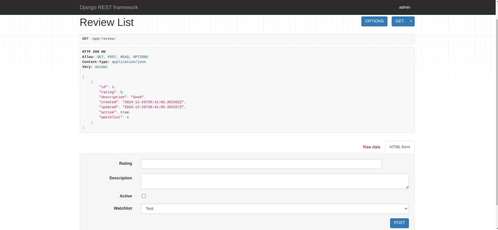
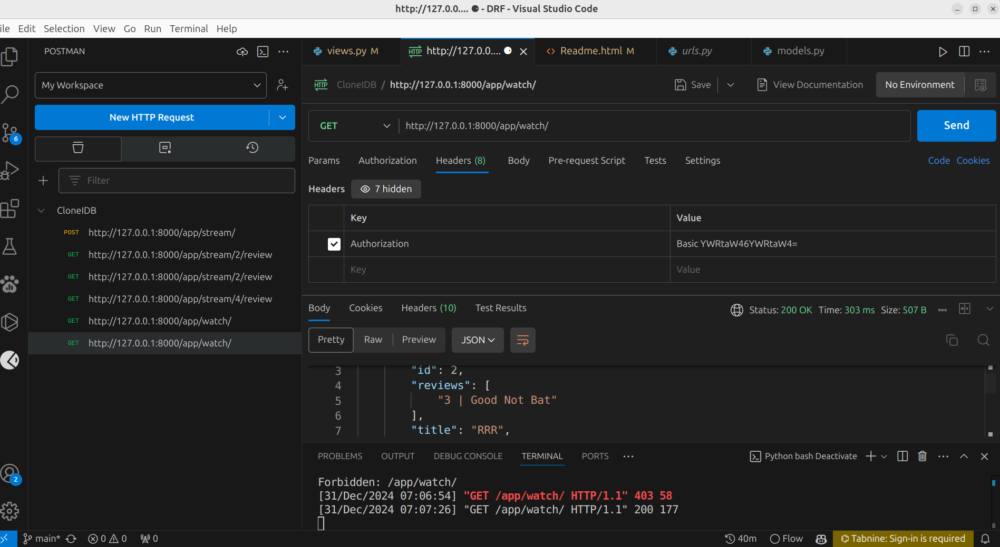
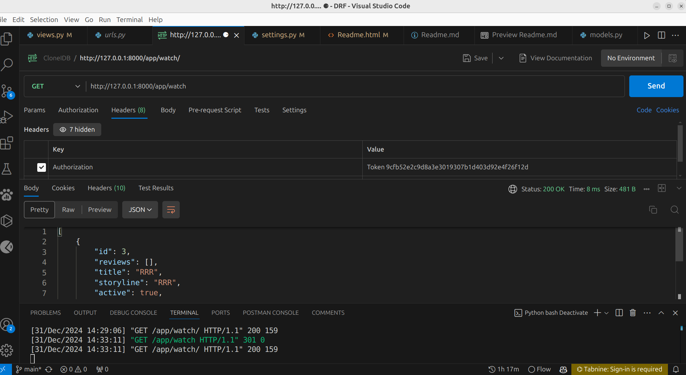
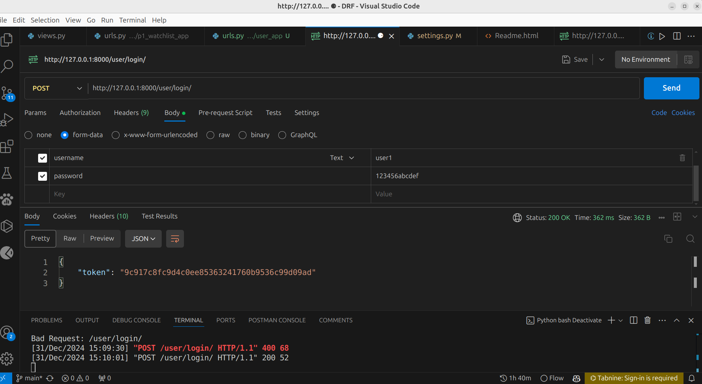
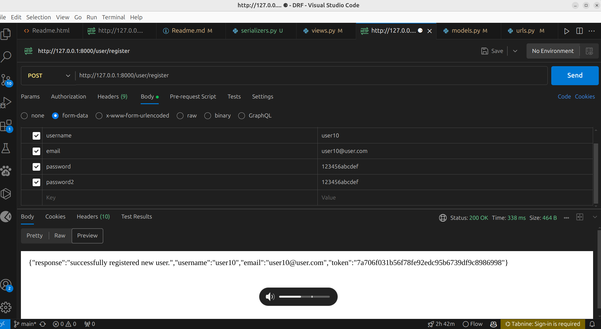
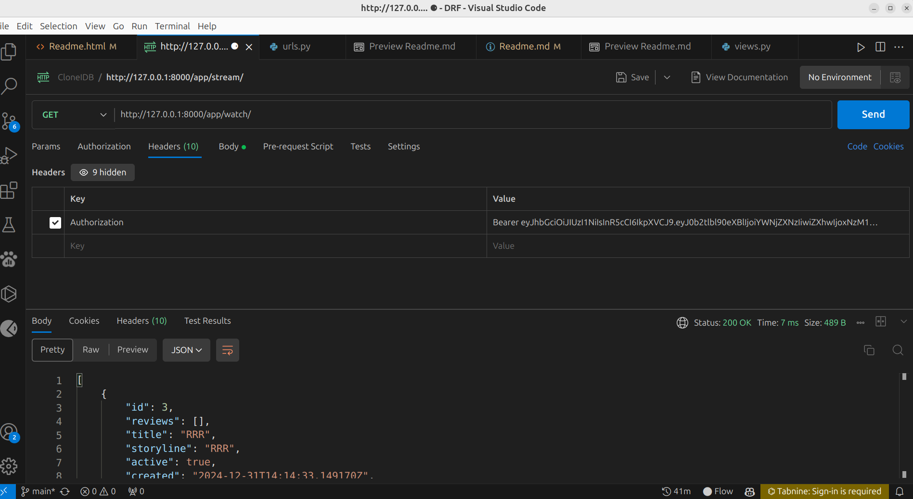
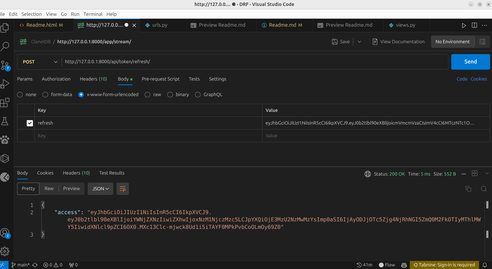

<!DOCTYPE html>
<html lang="en">
<head>
<meta charset="UTF-8">
<meta name="viewport" content="width=device-width, initial-scale=1.0">
<!-- <title>DRF</title> -->
</head>
<body>
<main>
<div class="container">
<div id="topic">
<h1>Topic:</h1>
<ol>
<li><a href="#intro">Intro</a></li>
<li><a href="#set_up">Set Up Virtual Environment</a></li>
<li><a href="#jsonResponse">Create JSON Response Without Any Framework</a></li>
<li><a href="#serialization">Serialization</a></li>
<li><a href="#view">View</a></li>
<li><a href="#functionbasedview">Functionbasedview</a></li>
<li><a href="#validation">Validation</a></li>
<li><a href="#customSerializerField">Custom Serializer Field</a></li>
<li><a href="#updatingModel">Update Model</a></li>
<li><a href="#nestedSerializer">Nested Serializer</a></li>
<li><a href="#seriliazerRelation">Serializer Relation</a></li>
<li><a href="#mixins">Mixins</a></li>
<li><a href="#concreteClassView">Concrete Class View</a></li>
<li><a href="#customQueryset">Custom Queryset</a></li>
<li><a href="#viewSetsAndRouters">View Sets And Routers</a></li>
<li><a href="#temporaryLoginLogout">Temporary Login And Logout</a></li>
<li><a href="#permissions">Permissions</a></li>
<li><a href="#customPermissionsClass">Custom Permissions Class</a></li>
<li><a href="#basicAuthentication">Basic Authentication</a></li>
<li><a href="tokenAuthenticationIntro">Token Authentication</a></li>
<li><a href="#tokenAuthorizationLogin">Token Authorization For Login</a></li>
<li><a href="#tokenAuthorizationForRegistrationAndGetToken">Token Authorization While Registration Complete</a></li>
<li><a href="#logOut">Token delete while logout</a></li>
<li><a href="#jwt">JWT</a></li>
<li><a href="#jwtRotateRefreshToken">JWT Rotation Refresh Token</a></li>
<li><a href="#jwtTokenCreationWhileRegistration">JWT Token Creation While Registration</a></li>
<li><a href="#throttlingIntro">Throttling Intro</a></li>
<li><a href="#throttleRate">Throttle Rate Limiting</a></li>
<li><a href="#customRateAndThrottle">Custom Rate Throttle</a></li>
<li><a href="#pagination">Pagination</a></li>
</ol>
</div>

<div id="intro">
<a href="#topic">Topic</a>
<h1>Introduction: </h1>
<h3>API + REST Architecture => REST API</h3>
<h3>REST API has 4 parts. These are: (i) End Points, (ii) Headers (Status Code), (iii) Methods (CRUD), (iv) The Data ( JSON )</h3>
</div>

<div id="set_up">
<a href="#topic">Topic</a>
<h1>Set Up Virtual Environment and Django and Rest Framework installation in environment</h1>

<h3>Create virtual environment:</h3>

```
python -m venv env1
```

<h3>Activate virtual environment</h3>

```
source path/env1/bin/activate
```

<h3>Install django and rest framework</h3>

```
pip install django
pip install djangorestframework
```

<h3>For increase productivity use tabnine and github copilot. You can install these from vs code extensions.Json Viewer pro for chrome extension.</h3>
</div>

<div id="jsonResponse">
<a href="#topic">Topic</a>
<h1>Create JSONResponse</h1>
<h3>It sends JSON response without REST Framework.</h3>

`views.py`

```py
def movie_list(request):
movies = Movie.objects.all() # it creates all objects from model
print (movies.values()) # prints all objects
data={'movies':list(movies.values())} # converts all objects to json
return JsonResponse(data) # returns json response

def movie_detail(request, pk):
try:
movies = Movie.objects.get(pk=pk) # it fetches a single object by id
data = {
'name':movies.name,
'description':movies.description,
'active':movies.active, 
} # converts object to json
except Movie.DoesNotExist:
return HttpResponse(status=404) # returns 404 if movie not found
return JsonResponse(data) # returns json response
```

`urls.py`
```py
from django.shortcuts import render
from django.urls import URLPattern,include,path
from .views import movie_list,movie_detail
urlpatterns=[
path('list/',movie_list,name='movie_list'),
path('list/<int:pk>',movie_detail),  # it searches for specific id
]
```
</div>

<div id="serialization">
<a href="#topic">Topic</a>
<h1>Serialization:</h1>
<h3>Most used these two serializer (i) Serializer (ii) ModelSerializer</h3>

<strong>Serializer</strong>

`serializers.py`

```py
from rest_framework import serializers
from .models import Movie
class MovieSerializer(serializers.Serializer): # General Serializer
class Meta:
model=Movie # Select Model
fields='__all__' # List of fields


class MovieModelSerializer(serializers.ModelSerializer): # Model serializer
class Meta:
model=Movie # select Model
fields='__all__' # select fields

```

<strong>ModelSerializer</strong>

`serializers.py`

```py
class MovieModelSerializer(serializers.ModelSerializer): # Model serializer . Don not need crud method. This is the benefit of model serializers.
class Meta:
model=Movie # select Model
fields='__all__' # select fields
exclude=['name','description']

```

<strong>Hyperlinked Model Serializer</strong>

`serializers.py`

```py
class StreamPlatformSerializer(serializers.HyperlinkedModelSerializer):
    watchlist=WatchListSerializer(many=True,read_only=True)
    class Meta:
        model=StreamPlatform
        fields='__all__'
```

`views.py`

```py
class StreamListAV(views.APIView):
    def get(self,request):
        platform=StreamPlatform.objects.all()
        serializer_class=StreamPlatformSerializer(platform,many=True,context={'request': request})
        return response.Response(serializer_class.data)

class StreamDetailAV(views.APIView):
    def get(self,request,pk):
        stream=StreamPlatform.objects.get(pk=pk)
        serializer=StreamPlatformSerializer(stream,context={'request': request})
        return response.Response(serializer.data)         
```
</div>


<div id="view">
<a href="#topic">Topic</a>

<h1>View:</h1>
<h3>Two types of views classbased and function based view. classbased view used four type of views (Generic views, Mixins, Concrete class views, Viewsets).
But function based views use decorator for view ( @api_view ).
</h3>

`views.py`
```py
@api_view() # need to use decorator for api views
def post(self): # function based
return JsonResponse(self)

class MovieViewSet(viewsets.ModelViewSet):
queryset = Movie.objects.all()
serializer_class = MovieModelSerializer # using serializer from serializers.py
```


</div>

<div id="functionbasedview">
<a href="#topic">Topic</a>
<h1>Functionbasedview:</h1>
<h3>Function based api view</h3>

`serializers.py`
```py
from rest_framework import serializers
from .models import Movie
class MovieSerializer(serializers.Serializer): # General Serializer
id=serializers.IntegerField(read_only=True)
name=serializers.CharField()
description=serializers.CharField()
active=serializers.BooleanField()
# class Meta:
# model=Movie # Select Model
# fields='__all__' # List of fields
```

`views.py`

```py
@decorators.api_view(['GET']) # from rest_framework import decorators
def movie_list(request):
movie=Movie.objects.all()
serializer=MovieSerializer(movie,many=True) # many=true means it check all object of serializer individually.
return response.Response(serializer.data)
```

<strong>Sample CRUD operation</strong>
<h3>For function based view</h3>

`views.py`

```py   
@decorators.api_view(['GET','POST','DELETE','PUT'])
def movie_detail(request, pk):
if request.method=='GET':
try:
movies = Movie.objects.get(pk=pk) # it fetches a single object by id
serializer=MovieSerializer(movies)
except Movie.DoesNotExist:
return HttpResponse(status=404) # returns 404 if movie not found
return response.Response(serializer.data) # returns json response
if request.method=='POST':
serializer=MovieSerializer(data=request.data)
if serializer.is_valid():
serializer.save()
return redirect('movie_list')
return HttpResponse('Something went wrong')
if request.method == 'PUT':
movie = Movie.objects.get(pk=pk)
serializer = MovieSerializer(movie, data=request.data)
if serializer.is_valid():
serializer.save()
return response.Response(serializer.data)
else:
return response.Response(serializer.errors, status=status.HTTP_400_BAD_REQUEST)
if request.method == 'DELETE':
movie = Movie.objects.get(pk=pk)
movie.delete()
return response.Response(status=status.HTTP_204_NO_CONTENT)
```

<h3>For class based view</h3>

`serializer.py`

```py
from rest_framework import serializers
from .models import Movie
class MovieSerializer(serializers.Serializer): # General Serializer
id=serializers.IntegerField(read_only=True)
name=serializers.CharField()
description=serializers.CharField()
active=serializers.BooleanField(read_only=True)


def create(self,validated_data):  # create method
movie = Movie.objects.create(**validated_data)
return movie   

def update(self, instance, validated_data): # update method
instance.name = validated_data.get('name', instance.name)
instance.description = validated_data.get('description', instance.description)
instance.active = validated_data.get('active', instance.active)
instance.save()
return instance 


class MovieModelSerializer(serializers.ModelSerializer): # Model serializer
class Meta:
model=Movie # select Model
fields='__all__' # select fields
```


`views.py`

```py
class movie_list(views.APIView):

def get(self,request): # instead of get condition and can not use if serializer.is_valid() in get method
movies=Movie.objects.all()
serializer=MovieSerializer(movies,many=True)
return response.Response(serializer.data)

def post(self,request): 
serializer=MovieSerializer(data=request.data)
if serializer.is_valid():
serializer.save()
return response.Response(serializer.data)
else:
return response.Response(serializer.errors)


class movie_detail(views.APIView):
def get(self,request,pk): # r = read operation
movie=Movie.objects.get(pk=pk)
serializer=MovieSerializer(movie)
return response.Response(serializer.data)

def post(self,request): # c = create operation
serializer=MovieSerializer(data=request.data)
if serializer.is_valid():
serializer.save()
return response.Response(serializer.data)
else:
return response.Response(serializer.errors)

def put(self,request,pk): # u = update operation
movie=Movie.objects.get(pk=pk)
serializer=MovieSerializer(movie,data=request.data)
if serializer.is_valid():
serializer.save()
return response.Response(serializer.data)
# return redirect('movie_list')
else:
return response.Response(serializer.errors)
# return redirect('movie_detail')

def delete(self,request,pk): # d = delete operation
movie=Movie.objects.get(pk=pk)
movie.delete()
return redirect('movie_list')
```
</div>

<div id="validation">
<a href="#topic">Topic</a>

<h1>Validation</h1>
<h3>It will update within 27 December, 2024</h3>


<!-- ``
```py

``` -->
</div>

<div id="customSerializerField">
<a href="#topic">Topic</a>

<h1>Custom Serializer Field</h1>

`serializer.py`

```py
class MovieModelSerializer(serializers.ModelSerializer): # Model serializer . Don not need crud method. This is the benefit of model serializers.
length_name = serializers.SerializerMethodField() # get the length
class Meta:
model=Movie # select Model
# fields=['name','description'] # select fields
exclude=['name','description']

def get_length_name(self,obj): # Custom method . this works like getter method
return len(obj.name)   
```
</div>


<div id="updatingModel">
<a href="#topic">Topic</a>
<h1>Updating model</h1>

`Use this command:`

``It is better to choice clean all data before updating the model.``

`For delete all data and delete all pycache files,__init__.py,migrations folder.`

```
python manage.py flush
```

`For update model, you can use this command:`

```
python manage.py makemigrations appName
```

```
python manage.py migrate
```

`You can also use this command`

```
python manage.py migrate --run-syncdb
```
</div>
<div id="nestedSerializer">
    <a href="#topic">Topic</a>
    <h1>Nested Serializer</h1>

`models.py`
```py
class WatchList(models.Model):
    title=models.CharField(max_length=40)
    storyline=models.CharField(max_length=40)
    active=models.BooleanField(default=True)
    created=models.DateTimeField(auto_now_add=True)
    platform=models.ManyToManyField(StreamPlatform, blank=True,related_name="watchlist") # it works like reverse lookup
    # platform=models.ForeignKey(StreamPlatform,on_delete=models.CASCADE,related_name="watchlist")

    def __str__(self):
        return self.title    
```
    
`serializers.py`
```py
class StreamPlatformSerializer(serializers.ModelSerializer):
    watchlist=WatchListSerializer(many=True,read_only=True) # used from WatchList model (nestedSerializer)
    class Meta:
        model=StreamPlatform
        fields='__all__'
```    

`Output before using nestedSerializers`

```
[
    {
        "id": 2,
        "name": "Netflix",
        "about": "netflix",
        "website": "http://netflix.com"
    },
    {
        "id": 3,
        "name": "Prime Video",
        "about": "Prime Video",
        "website": "http://primevideo.com"
    }
]
```

`Output after using nestedSerializers`

```
[
    {
        "id": 2,
        "watchlist": [
            {
                "id": 2,
                "title": "Test",
                "storyline": "Test",
                "active": true,
                "created": "2024-12-26T17:16:11.174810Z",
                "platform": [
                    2,
                    3
                ]
            }
        ],
        "name": "Netflix",
        "about": "netflix",
        "website": "http://netflix.com"
    },
    {
        "id": 3,
        "watchlist": [
            {
                "id": 2,
                "title": "Test",
                "storyline": "Test",
                "active": true,
                "created": "2024-12-26T17:16:11.174810Z",
                "platform": [
                    2,
                    3
                ]
            }
        ],
        "name": "Prime Video",
        "about": "Prime Video",
        "website": "http://primevideo.com"
    }
]
```
</div>
<div id="seriliazerRelation">
    <li><a href="#topic">Topic</a></li>
    <h1>Serializer Relation</h1>
    <h3>It only show specific information</h3>

<h2>StringRelatedField</h2>

`serializers.py`

```py
class StreamPlatformSerializer(serializers.ModelSerializer):
    watchlist=serializers.StringRelatedField(many=True,read_only=True) # only show the movie name
    class Meta:
        model=StreamPlatform
        fields='__all__'
```

<h2>HyperlinkedRelatedField</h2>

`serializers.py`

```py
class StreamPlatformSerializer(serializers.ModelSerializer):
    watchlist=serializers.HyperlinkedRelatedField(many=True,read_only=True,view_name='movie_detail')
    class Meta:
        model=StreamPlatform
        fields='__all__'
```

`views.py`

```py
class StreamListAV(views.APIView):
    def get(self,request):
        platform=StreamPlatform.objects.all()
        serializer_class=StreamPlatformSerializer(platform,many=True,context={'request': request}) # this context is for HyperlinkedRelatedField
        return response.Response(serializer_class.data)
```
<h3><a href="https://www.django-rest-framework.org/api-guide/relations/" target="_blank">For more visit here</a></h3>
</div>

<div id="mixins">
    <a href="#topic">Topic</a>
    <h1>Mixins</h1>
    <h3>Mixins create HTML form and json format. </h3>


<h2>ListModelMixin: Used for all attribute.</h2>
    
`views.py`

```py
class ReviewList(mixins.ListModelMixin,mixins.CreateModelMixin,generics.GenericAPIView):
    queryset=Review.objects.all()
    serializer_class=ReviewListSerializer
    def get(self,request):
        return self.list(request)
    def post(self,request):
        return self.create(request)

```    
<h3>Output:</h3>



<h3>RetriveModelMixin: Used for specific attribute.</h3>

`views.py`

```py
class ReviewDetail(mixins.RetrieveModelMixin,generics.GenericAPIView):
    queryset=Review.objects.all()
    serializer_class=ReviewListSerializer
    def get(self,request,pk):
        return self.retrieve(request)
    def put(self,request,pk):
        return self.update(request,pk)
```

<h3>Output:</h3>

</div>
<div id="concreteClassView">
    <a href="#topic"></a>
<h1>Concrete Class View:</h1>
<h3></h3>


`views.py`

```python
class ReviewList(generics.ListCreateAPIView): #ListAPIView with CreateAPIView is a class based view that provides get and post method handlers.
    queryset=Review.objects.all()
    serializer_class=ReviewListSerializer
    
class ReviewDetail(generics.RetrieveUpdateDestroyAPIView): # RetrieveUpdateDestroyAPIView is a class based view that provides get, put, patch and delete method handlers.
    queryset=Review.objects.all()
    serializer_class=ReviewListSerializer
```    
</div>
<div id="customQueryset">
    <a href="#topic">Topic</a>
<h1>Custom Queryset</h1>
<h3>It is used for custom queryset. Like as when we transfer money from our own bank account to another account we do not need to enter sender account address but we need to enter receiver account address. This kind of case handel this custom queryset. But which attribute is set auto in post method time, we need to exclude this from serializer.</h3>


`views.py`

```py
class CreateReview(generics.CreateAPIView):
    serializer_class=ReviewListSerializer
    queryset=Review.objects.all()
    def perform_create(self,serializer):
        pk=self.kwargs.get('pk')
        movie=WatchList.objects.get(pk=pk)
        serializer.save(watchlist=movie)
```
</div>
<div id="viewSetsAndRouters">
    <a href="#topic">Topic</a>
<h1>ViewSets and Routers</h1>


`views.py`

```py

```
</div>
<div id="temporaryLoginLogout">
    <a href="#topic">Topic</a>
<h1>Temporary Login and Logout</h1>
<h3>It provides a simple login logout forms.</h3>


`urls.py`

```py
path('api-auth/', include('rest_framework.urls')),  # Add this line
```
</div>

<div id="permission">
    <a href="#topic">Topic</a>
<h1>Permission</h1>
<h3>It provides authentication for API.</h3>


`settings.py`

```py
REST_FRAMEWORK = { # if we use use this only authenticated user can access the api. It works globally.
    'DEFAULT_PERMISSION_CLASSES': [
        'rest_framework.permissions.IsAuthenticated',
    ]
}
```

`views.py`

```py
from rest_framework import permissions
permission_classes=[permissions.IsAuthenticated] #nIt is objeect level permission. It works for specific view or object.
```

<a href="https://www.django-rest-framework.org/api-guide/permissions/">For more visit DRF documentation.</a>
</div>

<div id="customPermissionsClass">
    <a href="#topic">Topic</a>
<h1>Custom Permissions Class</h1>
<h3>It provides custom permission class.</h3>


`permissions.py`

```py
from rest_framework import permissions

class AdmimOrReadOnly(permissions.IsAdminUser):
    def has_permission(self, request, view):
        admin_permission=bool(request.user and request.user.is_staff)
        return request.method=="GET" or admin_permission

class ReviewUserOrReadOnly(permissions.BasePermission):
    def has_object_permission(self, request, view, obj):
        if request.method in permissions.SAFE_METHODS:
            return True
        return obj.review_user == request.user        
```

`views.py`

```py
class ReviewDetail(generics.RetrieveUpdateDestroyAPIView): # RetrieveUpdateDestroyAPIView is a class based view that provides get, put, patch and delete method handlers.
    permission_classes=[AdmimOrReadOnly] # admin can only edit access permissions, not admin read only permissions.
    queryset=Review.objects.all()
    serializer_class=ReviewListSerializer
```
</div>

<div id="basicAuthentication">
    <a href="#topic">Topic</a>
<h1>Basic Authentication</h1>
<h3>It provides authentication for API. Not recommended. Just used for testing. Use postman for authentication.</h3>


`settings.py`

```py
REST_FRAMEWORK = {
    'DEFAULT_AUTHENTICATION_CLASSES': [
       'rest_framework.authentication.BasicAuthentication',
       'rest_framework.authentication.SessionAuthentication',
   ]
}
```


`views.py`

```py
class movie_list(views.APIView):
    permission_classes=[permissions.IsAuthenticated]
    authentication_classes = [SessionAuthentication, BasicAuthentication] # it works for basic authentication
     def get(self,request): # instead of get condition and can not use if serializer.is_valid() in get method
        movies=WatchList.objects.all()
        serializer=WatchListSerializer(movies,many=True)
        return response.Response(serializer.data)
```

<h3>User password must be base64 encode format. Just search base64 converter on browser and convert this format username:password.</h3>


</div>    

<div id="tokenAuthenticationIntro">
    <a href="#topic">Topic</a>  
<h1>Token Authentication</h1>
<h3>Set Up: Add 'rest_framework.authtoken' on Intalled Apps.</h3>


`settings.py`

```py   
INSTALLED_APPS = [
    'rest_framework.authtoken',
]

REST_FRAMEWORK = {
    'DEFAULT_AUTHENTICATION_CLASSES': [
       'rest_framework.authentication.TokenAuthentication', # For Basic Authentication use 'rest_framework.authentication.BasicAuthentication',
       'rest_framework.authentication.SessionAuthentication',
   ]
}
```

<h3>Migrate the model. Before migrating delete all data from model. Otherwise it gives several errors.</h3>


<h3>Use this format for testing in postman.</h3>

</div>

<div id="tokenAuthorizationLogin">
    <a href="#topic">Topic</a>
<h1>Token Authorization Login</h1>
<h3>It provides token authorization login.</h3>


`urls.py`

```py
from rest_framework.authtoken.views import obtain_auth_token
from django.urls import path,include
urlpatterns = [
    path('login/', obtain_auth_token, name='login'),  # Add this line for token authorization login
]
```
<h3>Use this format for testing in postman.</h3>
<h3>Data input format be like this. Before input please confirm that postman has no token.</h3>

</div>

<div id="tokenAuthorizationForRegistrationAndGetToken">
    <a href="#topic">Topic</a>
<h1>Token Authorization For Registration and Get Token</h1>
<h3>It provides token authorization for registration and get token.</h3>


`models.py`

```py
from django.conf import settings
from django.db.models.signals import post_save
from django.dispatch import receiver
from rest_framework.authtoken.models import Token

@receiver(post_save, sender=settings.AUTH_USER_MODEL)
def create_auth_token(sender, instance=None, created=False, **kwargs):
    if created:
        Token.objects.create(user=instance)
```

`views.py`

```py
@decorators.api_view(["POST",])
def registeration_view(r):
    if r.method == "POST":
        serializer = RegistrationSerializer(data=r.data)
        data={}
        if serializer.is_valid():
            account=serializer.save()
            data["response"] = "successfully registered new user."
            data["username"] = account.username
            data["email"] = account.email
            token=Token.objects.get(user=account).key
            data["token"] = token
            # return response.Response(serializer.data, status=status.HTTP_201_CREATED)
        else:
            data= serializer.errors
            # return response.Response(data, status=status.HTTP_400_BAD_REQUEST)
        return response.Response(data)
```

<h3>Input and output format will be like this.</h3>

</div>

<div id="logOut">
    <a href="#topic">Topic</a>
<h1>Log Out</h1>
<h3>It provides log out.</h3>


`views.py`

```py

@decorators.api_view(["POST",])
def logOut(request):
    if request.method == "POST":
       request.user.auth_token.delete()
       return response.Response(status=status.HTTP_200_OK)

```

`urls.py`

```py
from rest_framework.authtoken.views import obtain_auth_token
from django.urls import path,include
from .views import registeration_view,logOut
urlpatterns=[
...
path('logout/', logOut, name='logout'),  # Add this line for log out
...
]
```

<h3>Now login first and save the token in token and then logout url.</h3>
</div>


<div id="jwt">
    <a href="#topic">Topic</a>
    <h1>JSON Web Tokens (JWT)</h1>
    <h3>It provides JSON Web Tokens (JWT). For django user <a href="https://django-rest-framework-simplejwt.readthedocs.io/en/latest/getting_started.html">Simple JWT</a></h3>

`Command for install jwt`

```
pip install djangorestframework-simplejwt
```

`settings.py`

```py
REST_FRAMEWORK = {
    ...
    'DEFAULT_AUTHENTICATION_CLASSES': (
        ...
        'rest_framework_simplejwt.authentication.JWTAuthentication', # instead of TokenAuthentication,BasicAuthentication
    )
    ...
}
```

`urls.py`

```py
from rest_framework_simplejwt.views import (
    TokenObtainPairView,
    TokenRefreshView,
)

urlpatterns = [
    ...
    path('api/token/', TokenObtainPairView.as_view(), name='token_obtain_pair'),
    path('api/token/refresh/', TokenRefreshView.as_view(), name='token_refresh'),
    ...
]
```
<h3>Generally two tokens create in JWT. (i) Access Token ( Short Term After 5 minutes it automatically destroy), (ii) Refresh Token ( Long Term After 24 hours it automatically destroy)</h3>
<h3>Input and output format be like this.</h3>
<h3>For getting tokens log in.</h3>


<h3>Using access token</h3>


<h3>Using refresh token. When use it, it give another access token which validation time is 5 minutes again.</h3>

</div>

<div id="jwtRotateRefreshToken">
    <a href="#topic">Topic</a>
    <h1>JWT Rotate Refresh Token</h1>
    <h3>It provides JWT Rotate Refresh Token. For django user <a href="https://django-rest-framework-simplejwt.readthedocs.io/en/latest/settings.html#rotate-refresh-tokens">Simple JWT</a></h3>

    <h3>Just add this line</h3>

`settings.py`

```py
SIMPLE_JWT
{
    ... 
    'ROTATE_REFRESH_TOKENS': True,
}
```
</div>

<div id="jwtTokenCreationWhileRegistration">
    <a href="#topic">Topic</a>
    <h1>JWT Token Creation While Registration</h1>
    <h3>It provides JWT Token Creation While Registration. For django user <a href="https://django-rest-framework-simplejwt.readthedocs.io/en/latest/getting_started.html">Simple JWT</a></h3>
    <h3>Use this format for testing in postman.</h3>
    <h3>Code part will update later.</h3>
</div>

<div id="throttlingIntro">
    <a href="#topic">Topic</a>
    <h1>Throttling: Control user by number of request. An authorized user can send unlimited request where unauthorized can send a certain number.</h1>
    <h3><a href="https://www.django-rest-framework.org/api-guide/throttling/">For more</a></h3>
</div>

<div id="throttleRate">
<a href="#topic">Topic</a>
<h1>Throttle Rate Limiting</h1>
<h3>For example, allow 100 requests per hour per IP address.</h3>
<h3>To implement this, install the rest_framework_throttling package.</h3>
<h3>Command for install throttling</h3>

`settings.py`
    
```py
REST_FRAMEWORK = {
    'DEFAULT_THROTTLE_CLASSES': [
       'rest_framework.throttling.AnonRateThrottle',
       'rest_framework.throttling.UserRateThrottle'
        ],
        'DEFAULT_THROTTLE_RATES': {
            'anon': '10/day',
            'user': '1000/day'
        }
    }
```

<h3>Input and output will be like this.</h3>

</div>

<div id="customRateAndThrottle">
    <a href="#topic">Topic</a>
<h1>Custom Rate and Throttle</h1>
<h3>It provides custom rate and throttle.</h3>
<h3>To implement this, create a custom throttle class and register it in the DEFAULT_THROTTLE_CLASSES list.</h3>
<h3>Code part will update within 10 th January, 2025</h3>
</div>

<div id="pagination">
    <a href="#topic">Topic</a>
</div>
</div>
</main>
</body>
</html>


